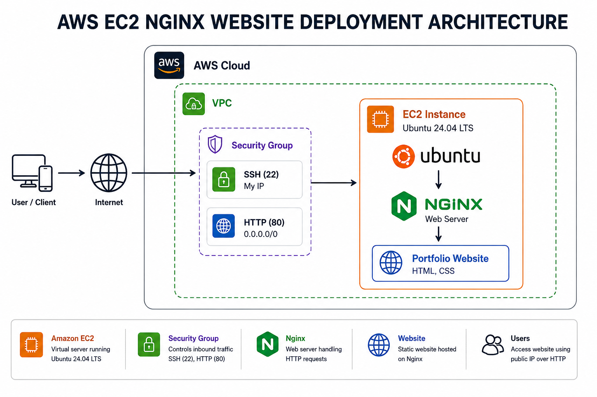

# AWS EC2 Nginx Website Deployment

## Project overview

This project demonstrates the deployment of a static portfolio website on an AWS EC2 Ubuntu server using Nginx. The objective of the project is to configure a Linux web server, deploy a website, and make it accessible through the internet using AWS infrastructure.

The project simulates a real-world web server deployment that is commonly performed by cloud and DevOps engineers.

<p align="center">
  
</p>
## AWS services used

* Amazon EC2
* AWS Security Groups
* AWS IAM
* Ubuntu Linux
* Nginx

## Features

* Deployed a website on an AWS EC2 Ubuntu instance
* Installed and configured Nginx
* Configured SSH and HTTP access through Security Groups
* Hosted a custom HTML and CSS portfolio website
* Managed the web server using Linux system administration commands
* Verified public website accessibility

## Deployment steps

### 1. Launch EC2 instance

* Ubuntu Server 24.04 LTS
* t2.micro instance
* 20 GB storage
* IAM user with appropriate permissions

### 2. Configure Security Group

Inbound rules:

* SSH (22) from My IP
* HTTP (80) from Anywhere

### 3. Connect to the server

SSH was used to connect to the EC2 Ubuntu instance.

### 4. Update the server

```bash
sudo apt update
sudo apt upgrade -y
```

### 5. Install Nginx

```bash
sudo apt install nginx -y
```

### 6. Verify Nginx

```bash
sudo systemctl status nginx
```

### 7. Deploy the website

The default Nginx page was replaced with a custom HTML and CSS portfolio website.

### 8. Restart Nginx

```bash
sudo systemctl restart nginx
```

### 9. Verify deployment

The website was successfully accessed using the public IPv4 address of the EC2 instance.

## Linux commands used

```bash
sudo apt update
sudo apt upgrade -y
sudo apt install nginx -y
cd /var/www/html
sudo rm index.nginx-debian.html
sudo nano index.html
sudo nano style.css
sudo systemctl restart nginx
sudo systemctl status nginx
sudo nginx -t
```

## Project structure

```text
aws-ec2-nginx-website-deployment/
│
├── README.md
├── architecture.png
├── website/
│   ├── index.html
│   └── style.css
└── screenshots/
    ├── ec2-instance.png
    ├── security-group.png
    ├── ssh-terminal.png
    ├── nginx-status.png
    └── portfolio-website.png
```

## Project screenshots

### EC2 instance


### Security group configuration


### SSH connection


### Nginx service status


### Portfolio website


## Learning outcomes

Through this project I learned:

* AWS EC2 instance management
* Linux server administration
* SSH connectivity
* Nginx installation and configuration
* Website deployment on a cloud server
* AWS Security Group configuration
* Basic production web server management

## Future improvements

* Configure a custom domain using Route 53
* Enable HTTPS using Let’s Encrypt SSL
* Automate deployment using GitHub Actions
* Containerize the application with Docker
* Implement CI/CD using Jenkins
* Provision infrastructure using Terraform

## Outcome

Successfully deployed a production-style static website on AWS EC2 using Ubuntu Linux and Nginx. The project demonstrates cloud infrastructure deployment, Linux server management, and web server configuration skills relevant to AWS and DevOps engineering roles.

## Author

**Divya**

AWS and DevOps portfolio project
